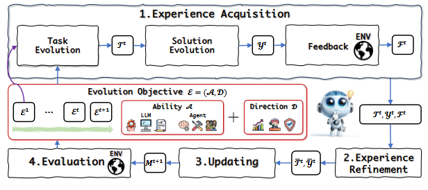
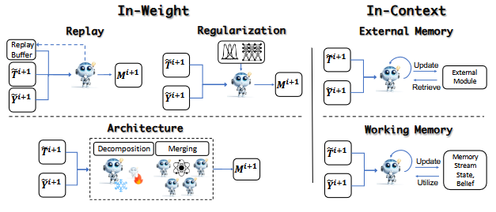
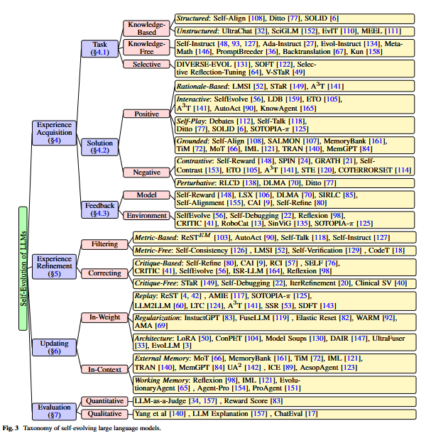

# A Survey on Self-Evolution of Large Language Models

## Authors
**Zhengwei Tao, Ting-En Lin, Xiancai Chen, Hangyu Li, Yuchuan Wu, Yongbin Li, Zhi Jin, Fei Huang, Dacheng Tao, Jingren Zhou**

## Abstract
Large Language Models (LLMs) have significantly improved AI applications but are costly and face limitations when relying on human supervision. To address these challenges, self-evolution techniques have emerged, enabling models to autonomously acquire, refine, and learn from their own experiences. Inspired by human learning, self-evolving LLMs present a paradigm shift towards autonomous, scalable AI development. This survey provides a conceptual framework for self-evolution, discusses existing approaches, and highlights future challenges and directions.

---

## 1. Introduction
LLMs like GPT-4, LLaMA, and Qwen have advanced NLP capabilities through three development stages:
1. **Pre-training** - Learning from large corpora.
2. **Supervised Fine-Tuning** - Adjusting for specific tasks.
3. **Human Alignment** - Optimizing responses to human preferences.

However, as task complexity increases, traditional training methods become unsustainable due to annotation difficulties and resource constraints. Inspired by self-learning systems like AlphaZero, researchers are exploring self-evolution techniques to improve LLMs autonomously.

**Key Contributions:**
- A **conceptual framework** outlining self-evolution phases.
- A **taxonomy** of self-evolving LLMs and LLM-based agents.
- A **discussion on challenges** and future directions.

---

## 2. Conceptual Framework
Self-evolution in LLMs follows an iterative cycle of four phases:

1. **Experience Acquisition**: The model generates tasks and solutions.
2. **Experience Refinement**: The model improves its outputs via filtering and correction.
3. **Updating**: The model integrates refined experiences into its learning process.
4. **Evaluation**: The model assesses its performance and sets new learning objectives.

---

## 3. Evolution Objectives
Evolution objectives define how an LLM self-improves. They consist of two components:
1. **Evolving Abilities** (e.g., reasoning, coding, instruction following).
2. **Evolution Directions** (e.g., performance improvement, knowledge expansion, bias reduction).

LLM self-evolution methods are classified into:
- **LLM-Specific Methods**: Enhance individual model capabilities.
- **LLM-Agent Methods**: Improve interaction and problem-solving in dynamic environments.

_**Table 1: Overview of Self-Evolution Methods**_

---

## 4. Experience Acquisition
Self-evolving LLMs acquire new experiences via:

### 4.1 Task Evolution
- **Knowledge-Based**: Tasks derived from structured/unstructured external knowledge.
- **Knowledge-Free**: Tasks generated by the model itself.
- **Selective**: Tasks selected from a predefined pool.

### 4.2 Solution Evolution
- **Positive Approaches**: Rationale-based, interactive learning, self-play, and grounded learning.
- **Negative Approaches**: Contrastive and perturbative learning (learning from errors).

### 4.3 Feedback Acquisition
- **Model-Based Feedback**: Self-evaluation and critique generation.
- **Environment-Based Feedback**: Real-world validation via interpreters, tool use, and embodied systems.

---

## 5. Experience Refinement
LLMs refine their outputs to improve learning quality via:

- **Filtering**:
  - **Metric-Based**: Using external evaluation criteria (e.g., F1-score, reward models).
  - **Metric-Free**: Using internal self-consistency and verification heuristics.
- **Correcting**:
  - **Critique-Based**: Model revises outputs based on self-generated critiques.
  - **Critique-Free**: Adjusting responses based on factual signals and execution results.

---

## 6. Updating
Updating methods integrate refined experiences to enhance model learning. Approaches include:

### 6.1 In-Weight Learning
- **Replay-Based**: Mixing new and old data to reinforce learning.
- **Regularization-Based**: Using constraints to prevent model drift.
- **Architecture-Based**: Using LoRA and model merging techniques to adapt learning structures.

### 6.2 In-Context Learning
- **External Memory**: Storing past knowledge for retrieval.
- **Working Memory**: Dynamically updating internal beliefs and behaviors based on past experiences.

---

## 7. Evaluation
Evaluation ensures the effectiveness of self-evolution through:
- **Quantitative Metrics**: Model reward scores and automated grading.
- **Qualitative Analysis**: Case studies, error analysis, and evolving benchmarks.

_**Table 2: Evaluation Methods**_

---

## 8. Open Problems
### 8.1 Diversity & Hierarchy of Objectives
- Current objectives cover limited real-world scenarios.
- Need for hierarchical goal-setting mechanisms.

### 8.2 Levels of Autonomy
- Most self-evolving frameworks require human intervention.
- Moving towards fully autonomous self-improvement.

### 8.3 Theoretical Understanding
- Limited understanding of LLM self-correction and its long-term effects.
- Need for more empirical and theoretical studies.

### 8.4 Stability-Plasticity Tradeoff
- Preventing catastrophic forgetting while adapting to new knowledge.

### 8.5 Systematic Evaluation
- Moving from static benchmarks to evolving, dynamic evaluation systems.

### 8.6 Safety & Superalignment
- Ensuring LLM alignment with ethical principles and societal values.

---

## 9. Conclusion
Self-evolution represents a paradigm shift in LLM training, enabling autonomous improvement akin to human learning. This survey provides a structured framework, highlights current progress, and identifies key challenges. Future research should focus on autonomy, stability, theoretical insights, and evaluation to advance self-evolving LLMs toward superintelligence.

---

