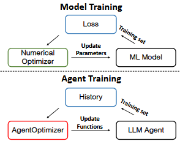
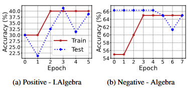
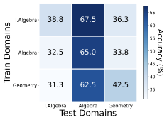
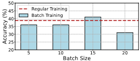
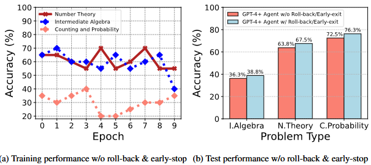
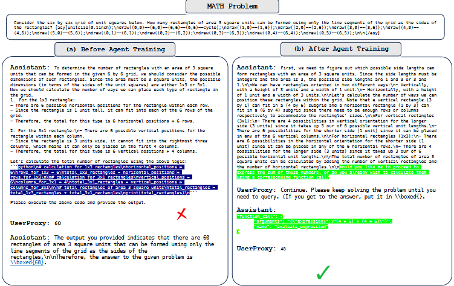

# Offline Training of Language Model Agents with Functions as Learnable Weights

## Authors
**Shaokun Zhang, Jieyu Zhang, Jiale Liu, Linxin Song, Chi Wang, Ranjay Krishna, Qingyun Wu**

## Abstract
Large Language Models (LLMs) can be framed as agents that utilize specialized functions to accomplish complex tasks. However, modifying LLM weights to improve their function use is often impractical due to resource constraints and proprietary restrictions. Inspired by human adaptability, this paper introduces **AgentOptimizer**, a method that treats functions as learnable parameters, enabling LLM agents to improve their performance without modifying model weights. Through extensive experiments, the authors demonstrate the effectiveness of this approach in various domains, including mathematical reasoning, tabular processing, and real-world problem-solving.

---

## 1. Introduction
The integration of functions into LLM agents allows them to extend their capabilities beyond text-based reasoning. While fine-tuning LLMs has been a common approach, it is computationally expensive and infeasible for proprietary models. **AgentOptimizer** provides an alternative by iteratively refining function sets through experience-driven optimization.

---

## 2. Methodology
### 2.1 Agent Training Paradigm
Instead of updating model weights, AgentOptimizer treats functions as learnable parameters and optimizes them using execution history and performance feedback. This avoids the need for numerical optimizers like SGD and Adam, replacing them with **LLM-driven function updates**.

### 2.2 The AgentOptimizer
AgentOptimizer updates functions using predefined actions:
- **Add function**: Introduce a new function based on performance needs.
- **Revise function**: Modify an existing function for improved accuracy.
- **Remove function**: Eliminate redundant or ineffective functions.
- **Terminate**: Halt optimization when no further improvements are possible.

The optimization process follows an iterative feedback loop based on performance evaluation.

---

## 3. Experiments
### 3.1 Experimental Setup
Experiments were conducted on three datasets:
1. **Mathematical Reasoning (MATH)** - Evaluating equation-solving capabilities.
2. **Tabular Processing (TabMWP)** - Assessing structured data interpretation.
3. **General Real-World Tasks (GAIA)** - Measuring adaptability in practical scenarios.

Two agent systems were tested:
- **GPT-4+ Agent** (GPT-4 with function calling and a code interpreter)
- **ReAct Agent** (interleaves reasoning traces and actions)

### 3.2 Main Results
Agent training led to substantial improvements in both GPT-4+ and ReAct agents.

---

## 4. Ablation Studies and Analysis
### 4.1 Effect of Roll-Back and Early-Stop
Removing roll-back and early-stop mechanisms resulted in unstable function updates and degraded test performance.

### 4.2 Domain Transferability
Training agents on one domain and testing them on another revealed that domain similarity significantly impacts transferability.

### 4.3 Scaling to Large Datasets
The study also explored batch training to extend agent training to larger datasets. While batch training allowed processing more data, it did not consistently improve test accuracy.

---

## 5. Comparison with Tool-Creation Methods
Unlike tool-creation methods that generate static tools for queries, agent training iteratively optimizes function sets based on execution history, leading to **better generalization and higher performance**.

---

## 6. Conclusion
Agent training via function optimization offers a scalable and computationally efficient alternative to LLM fine-tuning. By treating functions as learnable parameters, AgentOptimizer enhances the adaptability of LLM agents in diverse tasks. Future work should explore more robust optimization techniques and integration with external knowledge bases.

---

